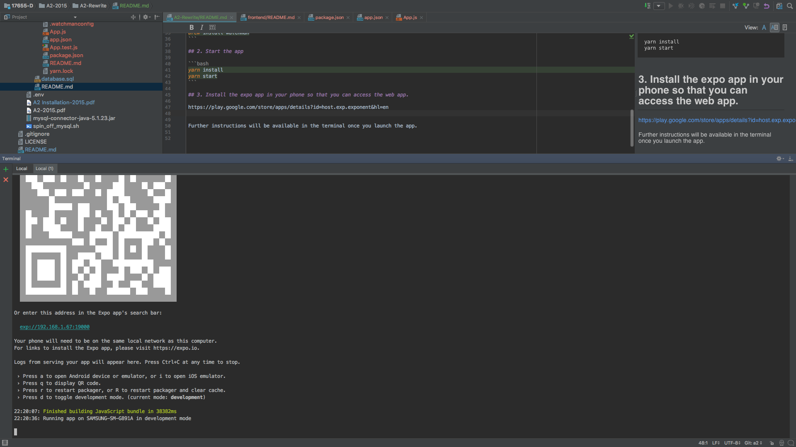

# Backend

## 1. Install yarn for package management

https://yarnpkg.com/lang/en/docs/install/

## 2. Install nvm to install different versions of nodejs

https://www.codementor.io/mercurial/how-to-install-node-js-on-macos-sierra-mphz41ekk

## 3. Install node v8.10.0 using nvm

```bash
nvm install 8.10.0
```

## 4. run the backend application

```bash
yarn install
yarn start
```

Open http://localhost:3000

You should see:

```Backend is alive```

# Frontend

## 1. Install watchman

```bash
brew install watchman
```

## 2. Start the app

```bash
yarn install
yarn start
```

## 3. Install the expo app in your phone so that you can access the web app.  

https://play.google.com/store/apps/details?id=host.exp.exponent&hl=en

Further instructions will be available in the terminal once you launch the app.

