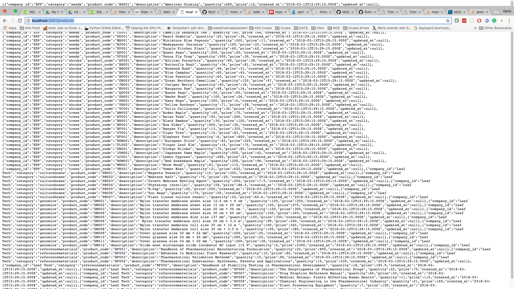
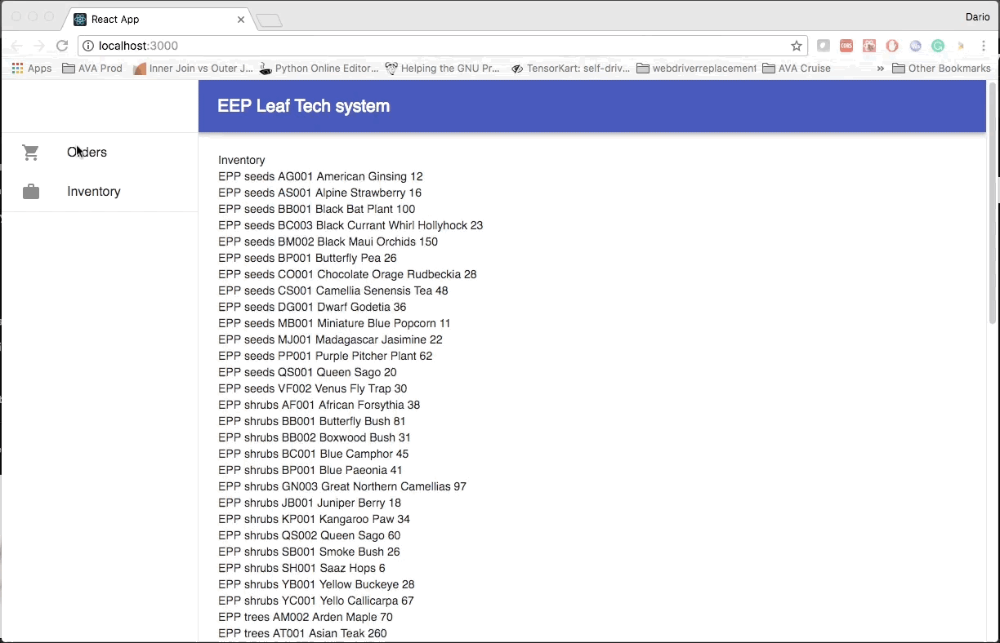

# 17655-D

## A2

### MySQL setup on Mac OS:

1. download Docker from: https://www.docker.com/docker-mac 

2. run:
```bash
cd A2-2015
chmod +x spin_off_mysql.sh
./spin_off_mysql.sh
```

If you restart your computer, the docker container will die, please find the container name using

```bash
docker ps -a
```

Then run it using:
```bash
docker <container-name> start
```

### Backend

#### 1. Install yarn for package management

https://yarnpkg.com/lang/en/docs/install/

#### 2. Install nvm to install different versions of nodejs

https://www.codementor.io/mercurial/how-to-install-node-js-on-macos-sierra-mphz41ekk

#### 3. Install node v8.10.0 using nvm

```bash
nvm install 8.10.0
```

#### 4. set backend database credentials

```bash
export EEP_DATABASE_ADMIN_NAME='eep_admin'
export EEP_DATABASE_PASSWORD='eep_password'
```

#### 5. run the backend application

```bash
cd A2-2015/A2-Rewrite/backend 
yarn install
yarn start
```


Open http://localhost:3001

You should see:



## Troubleshoot

If you get some weird mysql error, install mysql2 globally using:

```bash
npm install -g mysql2
```

### Frontend

#### 1. Install watchman

```bash
brew install watchman
```

#### 2. Start the app

Define ```REACT_APP_GOOGLE_OAUTH_TOKEN``` env var.

```bash
export REACT_APP_GOOGLE_OAUTH_TOKEN=<token>
export REACT_APP_BACKEND_URL=http://localhost:3001
```

```bash
cd A2-2015/A2-Rewrite/frontend 
yarn install
yarn start
```

Open http://localhost:3000

you should see the UI



## A1

Due Feb 22nd.

#### INSTRUCTIONS TO RUN a System

```bash
cd A1-2015/<System Name>
javac -cp ../Library/:. Plumber.java
java -cp ../Library/:. Plumber
```  

#### Instructions to RUN tests

```bash
cd A1-2015/LibraryTests
javac -cp ../Library/:. *.java
java -cp ../Library/:. TransformFrameFilterTests
```  


### System A

Feature:

  - 2 MidFilters for conversion of Temperature and Altitude, respectively
  - Output data to OutputA.dat in text format


### System B

Feature:

  - Adding a third pressure filter (linear path)
  - Output data to OutputB.dat in text format

TODO:
In case of wild point, compute the average of the last valid measurement and the next valid measurement in the stream.


### System C

## A2
